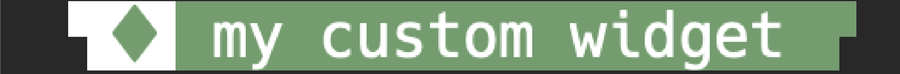

<h1 align="center">Tmux-style</h1>
<h2 align="center">Installation</h2>
<h3>Using <a href='https://github.com/tmux-plugins/tpm'>TPM</a></h3>

```sh
# tmux.conf
set -g @plugin 'tmux-plugins/tpm'
set -g @plugin 'Ninzalo/tmux-style'

# Your Tmux-style configuration here...

# Initialize TMUX plugin manager (keep this line at the very bottom of tmux.conf)
run '~/.tmux/plugins/tpm/tpm'
```

<h2 align='center'>Create a widget</h2>
<p>You can create your own widget in your <code>tmux.conf</code> file using <code>#{E:@tms-[your-widget-name]-[parts-amount]-widget}</code> format:</p>
<pre>set -ag status-left "#{E:@tms-[your-widget-name]-[parts-amount]-widget}"</pre>

> [!NOTE]
> Up to 20 parts are allowed.

> [!NOTE]
> `parts-amount` defaults to 4

> [!NOTE]
> `parts-amount` is not necessary attribute. `#{E:@tms-[your-widget-name]-widget}` is an allowed format. 4 parts will be created as a default (it equals to `#{E:@tms-[your-widget-name]-4-widget}`)

<p>In-built TMUX variables to midify:</p>
<ul>
    <li><code>status-left</code></li>
    <li><code>status-right</code></li>
    <li><code>window-status-format</code></li>
    <li><code>window-status-current-format</code></li>
</ul>
<p>All of the widget parameters will be created automatically. Run <code>tmux show-options -g</code> command to check it.</p>
<p>Auto-created parameters for each part:</p>
<ul>
    <li><code>@tms-[your-widget-name]-p[part-number]-value ""</code></li>
    <li><code>@tms-[your-widget-name]-p[part-number]-fg ""</code></li>
    <li><code>@tms-[your-widget-name]-p[part-number]-bg ""</code></li>
</ul>
<p>Customize the widget with <code>set -g @tms-[your-widget-name]-p[part-number]-[parameter] "[value]"</code></p>

<h2 align="center">In-built widgets</h2>
<ol>
    <li>Gruvbox</li>
    <ul>
        <li>session: </li>
        <li>current-window: </li>
        <li>default-window: </li>
        <li>gitmux:  (requires gitmux to be installed)</li>
        <li>directory: </li>
        <li>date-time: </li>
    </ul>
</ol>

<h2 align="center">Examples</h2>
<h3>Config 1 (used in this <a href='https://github.com/Ninzalo/dotfiles-tmux/blob/dc84bcc766e71bc1799f51649cdca09d95260625/tmux.conf#L84-L101'>tmux.conf</a>)</h3>


```sh
# tmux.conf
# ...

set -g status-left "" # Clear status-left
set -g status-right "" # Clear status-right

set -g @tms-colorscheme "gruvbox" # Load 'gruvbox' colorscheme [Default: gruvbox]

# Set a value in the 3rf part of in-built 'gitmux' widget
set -g @tms-gitmux-p3-value "#{?#(gitmux #{pane_current_path}), #(gitmux -cfg $HOME/.config/gitmux/.gitmux.conf #{pane_current_path}),}"

set -ag status-left "#{E:@tms-session-3-widget}" # Add in-built 'session' widget to status-left with 3 parts

set -ag status-right "#{E:@tms-gitmux-widget}" # Add in-built 'gitmux' widget to status-right with default amount of parts (4)
set -ag status-right "#{E:@tms-directory-widget}" # Add in-built 'directory' widget to status-right with default amount of parts (4)
set -ag status-right "#{E:@tms-date-time-widget}" # Add in-built 'date-time' widget to status-right with default amount of parts (4)

set -g window-status-current-format "#{E:@tms-current-window-widget}" # Customize default TMUX current window widget with gruvbox theme (contains 4 parts)
set -g window-status-format "#{E:@tms-default-window-widget}" # Customize default TMUX window widget with gruvbox theme (contains 4 parts)

# ...
```

<h3>Config 2</h3>


```sh
# tmux.conf
# ...

set -g status-left "" # Clear status-left

set -g @tms-custom-p1-value "▜" # Set "▜" as a value in the 1st part of 'custom' widget
set -g @tms-custom-p1-fg "#ffffff" # Set white as foreground color in the 1st part of 'custom' widget
set -g @tms-custom-p1-bg "#{E:@tms-thm-bg}" # Set @tms-thm-bg as background color in the 1st part of 'custom' widget
set -g @tms-custom-p2-value "♦ " # Set "♦ " as a value in the 2nd part of 'custom' widget
set -g @tms-custom-p2-fg "cyan"
set -g @tms-custom-p2-bg "#{E:@tms-custom-p1-fg}"
set -g @tms-custom-p3-value " my custom widget"
set -g @tms-custom-p3-fg "#ffffff"
set -g @tms-custom-p3-bg "cyan"
set -g @tms-custom-p4-value "█▛"
set -g @tms-custom-p4-fg "#{E:@tms-custom-p3-bg}"
set -g @tms-custom-p4-bg "#{E:@tms-custom-p1-bg}"

set -ag status-left "#{E:@tms-custom-widget}" # Create default values for 'custom' widget with default amount of parts (4)
# Or: set -ag status-left "#{E:@tms-custom-4-widget}" # Gives the same result

# ...
```

<h3>Config 3</h3>


```sh
# tmux.conf
# ...

set -g status-left "" # Clear status-left

set -g @tms-custom2-p1-value "▟"
set -g @tms-custom2-p1-fg "white"
set -g @tms-custom2-p1-bg "#{E:@tms-thm-bg}"
set -g @tms-custom2-p2-value "   my second custom widget"
set -g @tms-custom2-p2-fg "red"
set -g @tms-custom2-p2-bg "#{E:@tms-thm-bg}"

set -ag status-left "#{E:@tms-custom2-2-widget}" # Create default values for 'custom2' widget with 2 parts
# ...
```
