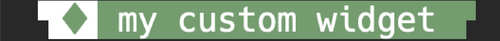

<div align="center">
    <h1>
        Tmux-style: Transform Your Tmux Status Line with Themes
            & Dynamic Widgets
    </h1>
    <div>
        
        
        
        
    </div>
</div>
<p>
    Tmux-style is the ultimate tmux plugin for deep customization of your
    status line. With Tmux-style, easily apply beautiful, ready-made themes,
    or craft your own custom colorschemes for a look that’s all your own.
    Build powerful widgets that showcase dynamic data at a glance, and
    experience unparalleled flexibility with configuration options that let
    you control colors, styles, and layouts. Make your tmux workspace as
    productive and unique as you are.
</p>

<h2 align="center">Requirements:</h2>
<p>To get started with Tmux-style, make sure you have the following:</p>
<ul>
    <li>POSIX-compatible shell</li>
    <li><a href='https://github.com/tmux/tmux'>tmux</a></li>
    <li><a href='https://www.gnu.org/software/sed/#download'>sed</a></li>
</ul>

<h2 align="center">Installation</h2>
<h3>Using <a href='https://github.com/tmux-plugins/tpm'>TPM (Tmux Plugin Manager)</a></h3>
<p>To install Tmux-style using TPM, follow these steps:</p>

```sh
# tmux.conf
set -g @plugin 'tmux-plugins/tpm'
set -g @plugin 'Ninzalo/tmux-style'

# Your Tmux-style configuration here...

# Initialize Tmux Plugin Manager (keep this line at the very bottom of tmux.conf)
run '~/.tmux/plugins/tpm/tpm'
```

<h2 align="center">Widgets</h2>
<h3>Built-in Widgets</h3>
<p>Tmux-style includes several pre-built widgets that can be used as a part of
    your status line:
</p>
<ul>
    <li>session</li>
    <li>current-window</li>
    <li>default-window</li>
    <li>gitmux (requires <a href='https://github.com/arl/gitmux'>gitmux</a>
        to be installed)
    </li>
    <li>directory</li>
    <li>date-time</li>
</ul>
<p>These widgets bring a visually appealing and highly functional status line 
    to your tmux configuration.
</p>

<h3>Create Your Own Widget</h3>
<p>You can create custom widgets directly in your <code>tmux.conf</code> file.
</p>
<p>Use the format
    <code>#{E:@tmst-[your-widget-name]-[parts-amount]-widget}</code>
    to define a new widget:
</p>
<pre>set -ag status-left "#{E:@tmst-[your-widget-name]-[parts-amount]-widget}"</pre>

> [!NOTE]
> The `parts-amount` attribute specifies the number of parts, defaulting to 4.
    You can create up to 20 parts.

<p>Supported tmux variables for widget placement:</p>
<ul>
    <li><code>status-left</code></li>
    <li><code>status-right</code></li>
    <li><code>window-status-format</code></li>
    <li><code>window-status-current-format</code></li>
</ul>

<p>Each widget part comes with pre-defined parameters that are automatically 
    created in your configuration, allowing for simple yet powerful 
    customization without the need for extensive setup. For each part in a 
    widget, the following parameters are generated:
</p>
<ul>
    <li>Value (<code>@tmst-[your-widget-name]-p[part-number]-value</code>)</li>
    <li>Foreground color
        (<code>@tmst-[your-widget-name]-p[part-number]-fg</code>)
    </li>
    <li>Background color
        (<code>@tmst-[your-widget-name]-p[part-number]-bg</code>)
    </li>
</ul>
<p>To check automatically generated parameters, run:</p>

```sh
tmux show-options -g
```

<p>Each of these parameters can be customized directly in your tmux.conf file.
    To set a unique style for each part, specify the desired value
    (<code>value</code>), foreground color (<code>fg</code>), and 
    background color (<code>bg</code>), as shown below:
</p>

```sh
# Customize a part of your widget
set -g @tmst-[your-widget-name]-p[part-number]-value "Your Text or Command Here"
set -g @tmst-[your-widget-name]-p[part-number]-fg "green"
set -g @tmst-[your-widget-name]-p[part-number]-bg "black"
```

<p>This flexibility allows you to modify colors and text for each widget part,
    fitting any theme or personal preference effortlessly.
</p>

<h2 align="center">Colorschemes</h2>
<h3>Using Built-in Colorschemes</h3>
<p>Apply a built-in colorscheme by setting the
    <code>@tmst-colorscheme</code> variable:
</p>

```sh
# tmux.conf
# ...

# Load built-in 'gruvbox-dark' colorscheme [Default: gruvbox-dark]
set -g @tmst-colorscheme "gruvbox-dark"

# ...
```

<h4>Available colorschemes:</h4>
<ul>
    <li>gruvbox-dark</li>
    
    <li>gruvbox-material</li>
    
    <li>gruvbox-light</li>
    
    <li>catppuccin-mocha</li>
    
    <li>catppuccin-macchiato</li>
    
    <li>catppuccin-frappe</li>
    
    <li>catppuccin-latte</li>
    
    <li>solarized-dark</li>
    
    <li>solarized-light</li>
    
</ul>

> [!NOTE]
> Built-in colorschemes are designed to work exclusively with all built-in
    widgets and default tmux variables, such as: <code>status-bg</code>,
    <code>status-fg</code>, <code>message-style</code> and
    <code>message-command-style</code>. For custom styling beyond these
    settings, consider using a custom colorscheme.

<h3>Adding a Custom Colorscheme</h3>
<p>You can specify your own colorscheme file path in the
    <code>@tmst-custom-colorscheme-path</code> variable in
    <code>tmux.conf</code>:
</p>

```sh
# tmux.conf
# ...

# Load 'custom' colorscheme
set -g @tmst-custom-colorscheme-path "/path/to/custom.conf"

# ...
```
> [!IMPORTANT]
> When using a custom colorscheme, you don’t need to set
    <code>@tmst-colorscheme</code> as it will be overridden.

<h2 align="center">Example Configurations</h2>
<h3>Config 1 (used in this <a href='https://github.com/Ninzalo/dotfiles-tmux/blob/9dc0474ec007eefe071c1639916af9e16f02e295/tmux.conf#L84-L101'>tmux.conf</a>)</h3>


```sh
# tmux.conf
# ...

set -g status-left "" # Clear status-left
set -g status-right "" # Clear status-right

# Use Gruvbox-dark theme
set -g @tmst-colorscheme "gruvbox-dark"

# Set a value in the 3rd part of built-in 'gitmux' widget
set -g @tmst-gitmux-p3-value "#{?#(gitmux #{pane_current_path}), #(gitmux -cfg $HOME/.config/gitmux/.gitmux.conf #{pane_current_path}),}"

# Add built-in 'session' widget to status-left with 3 parts
set -ag status-left "#{E:@tmst-session-3-widget}"

# Add built-in widgets to status-right
set -ag status-right "#{E:@tmst-gitmux-widget}"
set -ag status-right "#{E:@tmst-directory-widget}"
set -ag status-right "#{E:@tmst-date-time-widget}"

# Add built-in window widgets
set -g window-status-current-format "#{E:@tmst-current-window-widget}"
set -g window-status-format "#{E:@tmst-default-window-widget}"

# ...
```

<h3>Config 2</h3>


```sh
# tmux.conf
# ...

set -g status-left "" # Clear status-left

# Define a 'custom' widget parameters
set -g @tmst-custom-p1-value "▜" # Set "▜" as a value in the 1st part of 'custom' widget
set -g @tmst-custom-p1-fg "#ffffff" # Set white as foreground color in the 1st part of 'custom' widget
set -g @tmst-custom-p1-bg "#{E:@tmst-thm-bg}" # Set @tmst-thm-bg as background color in the 1st part of 'custom' widget
set -g @tmst-custom-p2-value "♦ " # Set "♦ " as a value in the 2nd part of 'custom' widget
set -g @tmst-custom-p2-fg "cyan"
set -g @tmst-custom-p2-bg "#{E:@tmst-custom-p1-fg}"
set -g @tmst-custom-p3-value " my custom widget"
set -g @tmst-custom-p3-fg "#ffffff"
set -g @tmst-custom-p3-bg "cyan"
set -g @tmst-custom-p4-value "█▛"
set -g @tmst-custom-p4-fg "#{E:@tmst-custom-p3-bg}"
set -g @tmst-custom-p4-bg "#{E:@tmst-custom-p1-bg}"

# Add 'custom' widget to status-left
set -ag status-left "#{E:@tmst-custom-widget}" # Create default values for 'custom' widget with default amount of parts (4)
# Or: set -ag status-left "#{E:@tmst-custom-4-widget}" # Gives the same result

# ...
```

<h3>Config 3</h3>


```sh
# tmux.conf
# ...

set -g status-left "" # Clear status-left

# Define 'custom2' widget parameters
set -g @tmst-custom2-p1-value "▟"
set -g @tmst-custom2-p1-fg "white"
set -g @tmst-custom2-p1-bg "#{E:@tmst-thm-bg}"
set -g @tmst-custom2-p2-value "   my second custom widget"
set -g @tmst-custom2-p2-fg "red"
set -g @tmst-custom2-p2-bg "#{E:@tmst-thm-bg}"

# Add 'custom2' widget to status-left
set -ag status-left "#{E:@tmst-custom2-2-widget}" # Create default values for 'custom2' widget with 2 parts

# ...
```

<h2 align='center'>Credits</h2>
<ul>
    <li>
        <a href='https://github.com/morhetz'>
            @morhetz
        </a> - <a href='https://github.com/morhetz/gruvbox'>
            gruvbox
        </a> colorscheme
    </li>
    <li>
        <a href='https://github.com/Mofiqul'>
            @Mofiqul
        </a> - <a href='https://github.com/Mofiqul/vscode.nvim/tree/main'>
            gruvbox-material
        </a> colorscheme
    </li>
    <li>
        <a href='https://github.com/catppuccin'>
            @catppuccin
        </a> - <a href='https://github.com/catppuccin/tmux'>
            catppuccin
        </a> colorscheme
    </li>
    <li>
        <a href='https://github.com/altercation'>
            @altercation
        </a> - <a href='https://github.com/altercation/solarized'>
            solarized
        </a> colorscheme
    </li>
</ul>
